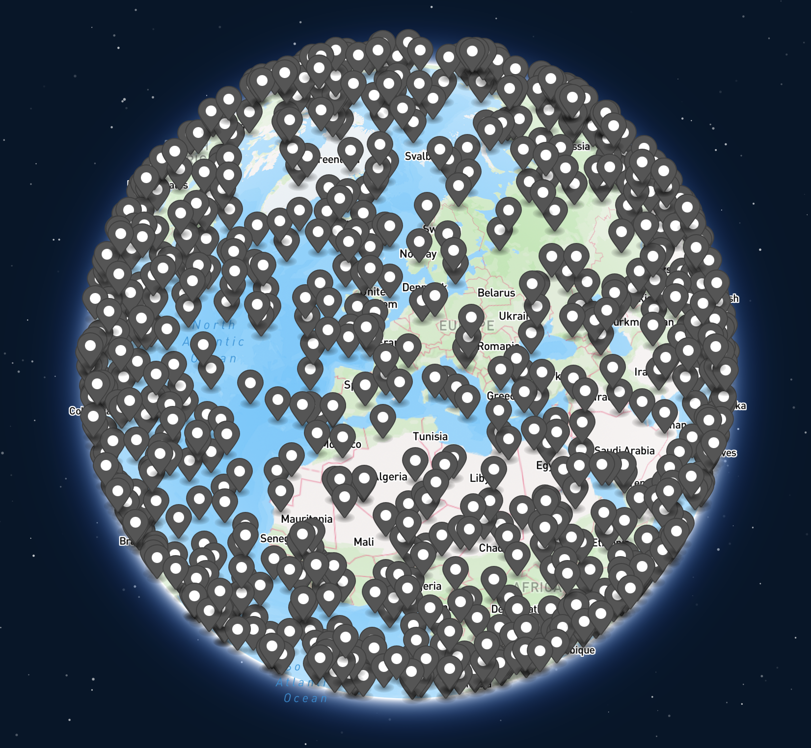
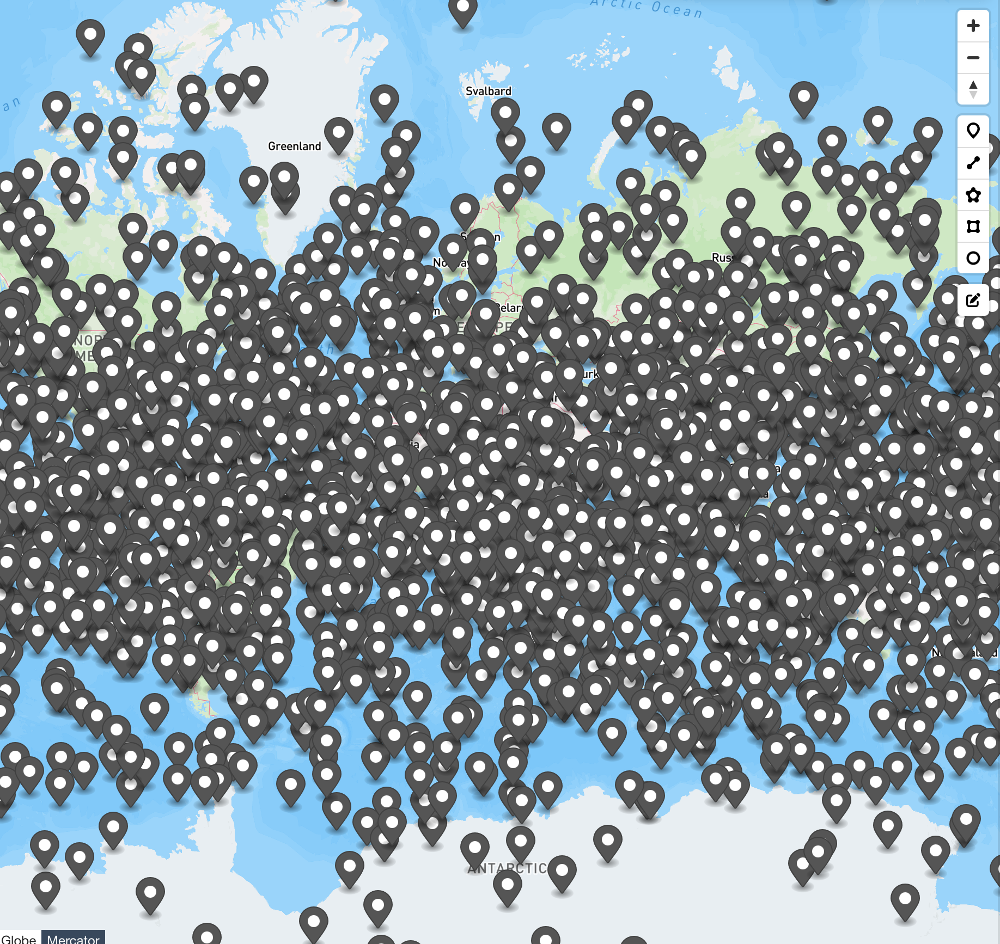
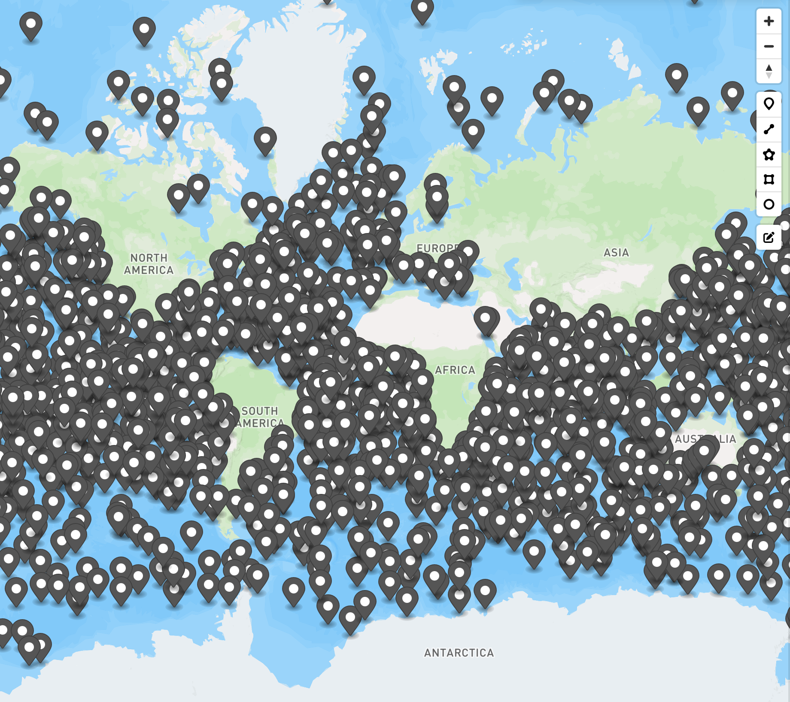
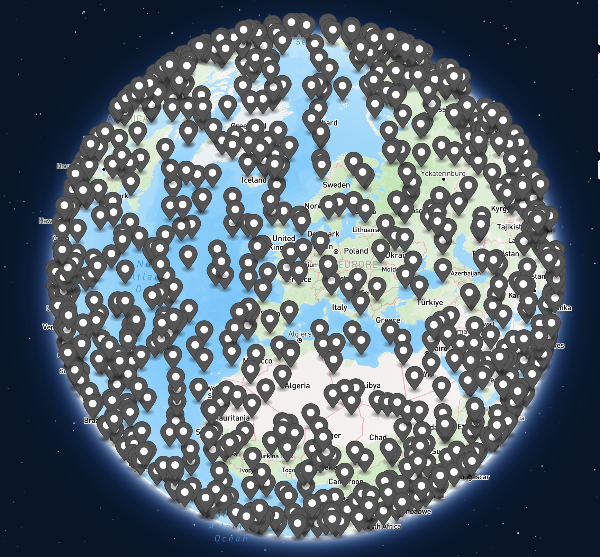
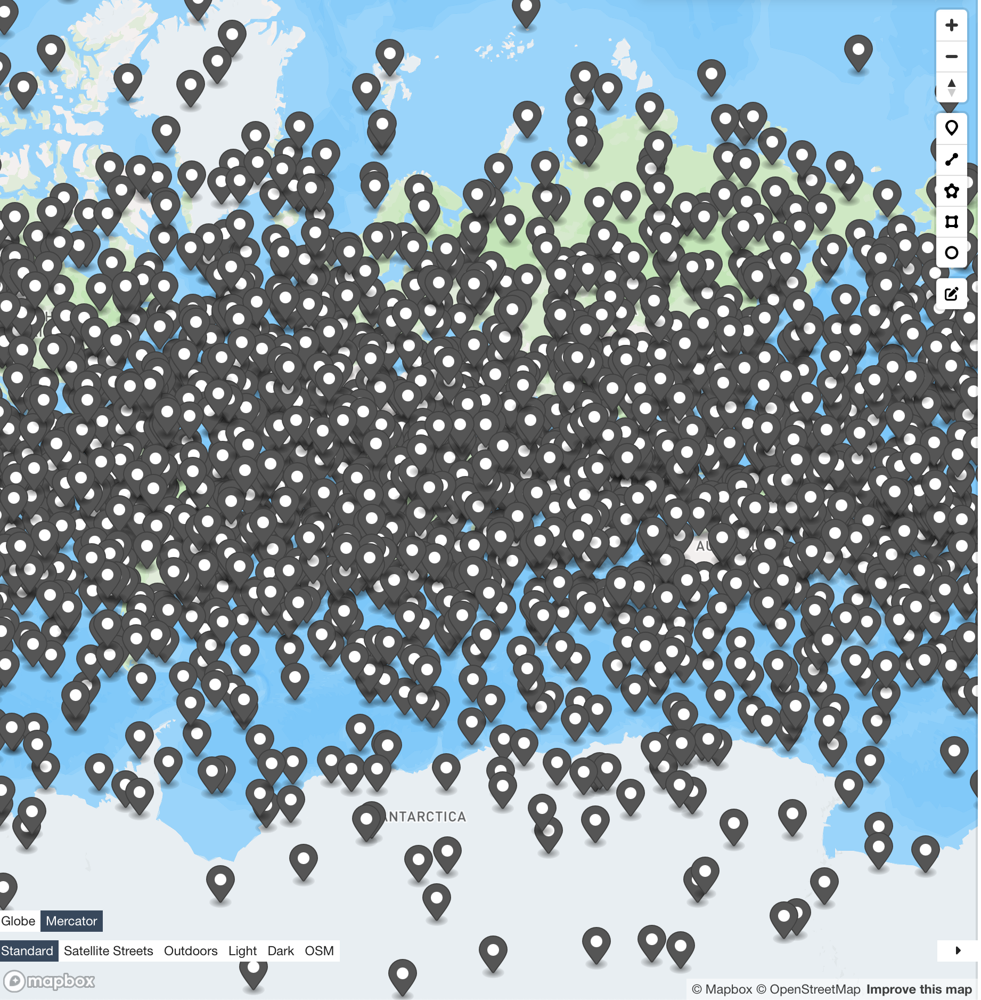
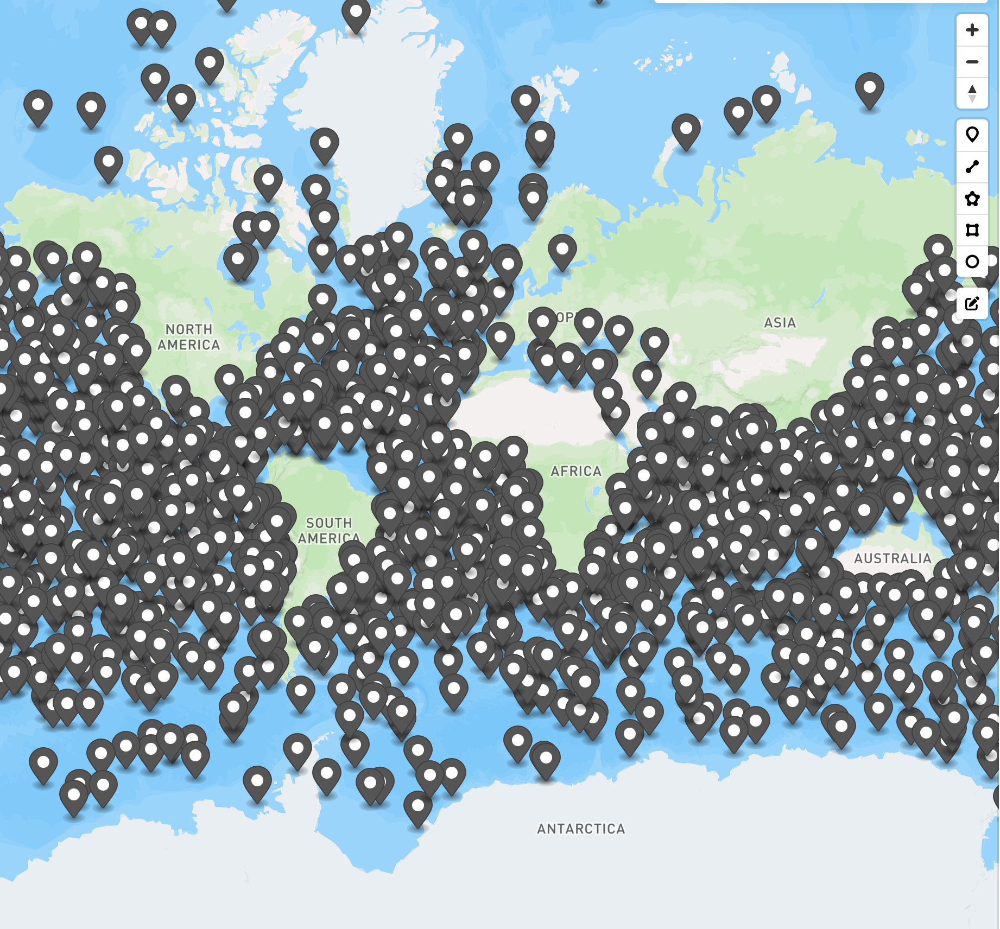
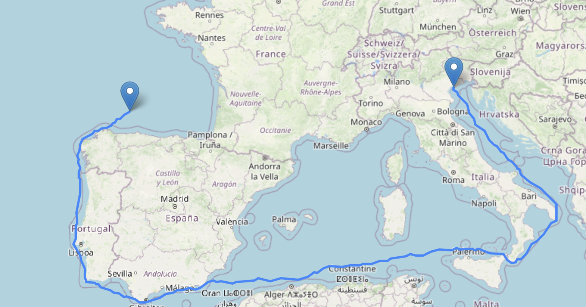
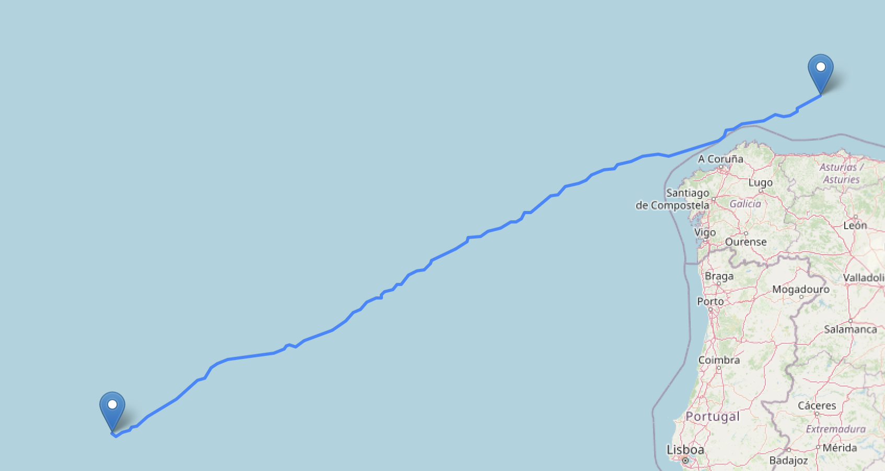
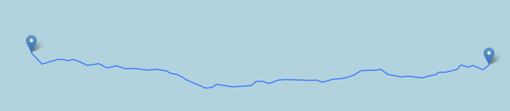
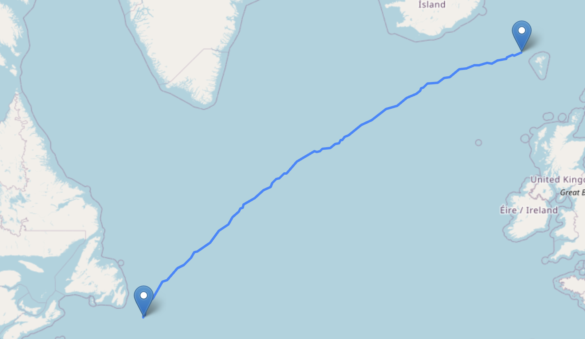

# Lab Course Algorithms on OSM Data

> [!NOTE]  
> Don't forget to clone with `--recursive`

## Building
Docker is just used for building, so we don't need to install all the dependencies.

1. `git clone --recursive https://github.com/h-waldschmidt/lab-osm.git`
2. `docker build -t labosm-builder .`
3. `docker run --rm -v ./:/app labosm-builder`

## Running
Run `./build/labosm` to see most usage examples.

For image based filtering download [this image from NASA](https://eoimages.gsfc.nasa.gov/images/imagerecords/73000/73963/gebco_08_rev_bath_21600x10800.png).

Example workflow looks like this to generate graph with `4M` points and run simpleserver with just dijkstra algorithm:
1. `./build/labosm generate_points planet-coastlinespbf-cleaned.osm.pbf output/4M 4000000`
2. `./build/labosm points_to_fmi output/4M_filtered_points.geojson output/6M_graph.fmi`
3. `./build/labosm simpleserver output/4M_graph.fmi`

## Benchmarks
- Point in Polygon test with 16 Threads 4M Points: `35470860ms = 9h 51m`
  - Results in `4000000` Points in water `grep -o "Point" < filtered_points_4M.geojson | wc -l`
- On Land filtering based on image test 4M Points: `3155ms = 3,1s`
    - Results in `4000000` Points in water `grep -o "Point" < filtered_points_image_4M.geojson | wc -l`
- Generating FMI Graph with 16 Threads and `4000000` Points: `9874 = 9,8s`
  - Results in `21754558` Edges

TODO: 9836595ms for 1M Graph

### Preprocessing Time

#### Stuttgart Graph (Nodes: 1132113 Edges: 2292887)

| Heuristic       | CH  | Edges   | Hub labels | Avg. Label Size |
| --------------- | --- | ------- | ---------- | --------------- |
| IN_OUT          | 4s  | 4583380 | 9s         | 93.5065         |
| EDGE_DIFFERENCE | 9s  | 4617667 | 7s         | 70.9465         |
| WEIGHTED_COST   | 19s | 4721720 | 6s         | 68.0572         |
| MIXED           | 13s | 4431611 | 5s         | 57.9925         |

#### BW Graph (Nodes: 3600520 Edges: 7300290)

| Heuristic       | CH  | Edges    | Hub labels | Avg. Label Size |
| --------------- | --- | -------- | ---------- | --------------- |
| IN_OUT          | 18s | 14632356 | 147s       | 130.341         |
| EDGE_DIFFERENCE | 38s | 14716275 | 30s        | 92.2433         |
| WEIGHTED_COST   | 79s | 15063747 | 28s        | 88.3935         |
| MIXED           | 53s | 14157775 | 24s        | 83.2474         |

#### Ocean Graph 1M (Nodes: 1000000 Edges: 4421584)

| Heuristic       | CH   | Edges    | Hub labels | Avg. Label Size |
| --------------- | ---- | -------- | ---------- | --------------- |
| IN_OUT          | 660s | 13263627 | 328s       | 529.169         |
| EDGE_DIFFERENCE | 420s | 12026983 | 126s       | 296.746         |
| WEIGHTED_COST   | 835s | 12278641 | 109s       | 285.777         |
| MIXED           | 395s | 11027721 | 92s        | 268.63          |

#### Ocean Graph 4M (Nodes: 4000000 Edges: 21757192)

| Heuristic       | CH      | Edges     | Hub labels | Avg. Label Size |
| --------------- | ------- | --------- | ---------- | --------------- |
| IN_OUT          | 125373s | 110253218 | N/A        | N/A             |
| EDGE_DIFFERENCE | 39411s  | 90591032  | N/A        | N/A             |
| WEIGHTED_COST   | 99414s  | 95547492  | N/A        | N/A             |
| MIXED           | 48650s  | 83298576  | 7633s      | 1170.24         |

### Query Time

10000 Random queries

#### Stuttgart Graph

With `std::priority_queue`:

| Algorithm                       | Avg. Query Time (us) | Avg. Path Time (us) | Avg. PQ Pops | Speed-up |
| ------------------------------- | -------------------- | ------------------- | ------------ | -------- |
| Dijkstra                        | 86065.7              | 23.1336             | 585490       | 1x       |
| CH (IN_OUT)                     | 146.305              | 133.126             | 856.228      | 588.262x |
| Hub Labels (IN_OUT CH)          | 1.4074               | 105.107             | 0            | 61152.3x |
| CH (EDGE_DIFFERENCE)            | 110.614              | 135.859             | 706.994      | 778.075x |
| Hub Labels (EDGE_DIFFERENCE CH) | 1.3343               | 122.099             | 0            | 64502.5x |
| CH (WEIGHTED_COST)              | 93.2113              | 115.63              | 634.294      | 923.34x  |
| Hub Labels (WEIGHTED_COST CH)   | 1.4695               | 121.684             | 0            | 58568x   |
| CH (MIXED)                      | 66.2676              | 108.754             | 495.195      | 1298.76x |
| Hub Labels (MIXED CH)           | 1.3206               | 103.183             | 0            | 65171.7x |

With `radix_heap::pair_radix_heap`:

| Algorithm                       | Avg. Query Time (us) | Avg. Path Time (us) | Avg. PQ Pops | Speed-up |
| ------------------------------- | -------------------- | ------------------- | ------------ | -------- |
| Dijkstra                        | 53291.3              | 17.6208             | 590149       | 1x       |
| CH (IN_OUT)                     | 123.723              | 92.6065             | 839.63       | 430.732x |
| Hub Labels (IN_OUT CH)          | 1.1348               | 82.4076             | 0            | 46960.9x |
| CH (EDGE_DIFFERENCE)            | 94.5666              | 87.9531             | 685.477      | 563.532x |
| Hub Labels (EDGE_DIFFERENCE CH) | 1.0923               | 80.7168             | 0            | 48788.1x |
| CH (WEIGHTED_COST)              | 89.8271              | 90.4479             | 627.647      | 593.265x |
| Hub Labels (WEIGHTED_COST CH)   | 1.1187               | 81.3062             | 0            | 47636.8x |
| CH (MIXED)                      | 68.294               | 83.978              | 498.966      | 780.321x |
| Hub Labels (MIXED CH)           | 1.0394               | 78.5008             | 0            | 51271.2x |

Flatten graph arrays and CH node reordering:

| Algorithm                       | Avg. Query Time (us) | Avg. Path Time (us) | Avg. PQ Pops | Speed-up |
| ------------------------------- | -------------------- | ------------------- | ------------ | -------- |
| Dijkstra                        | 38993.6              | 13.8938             | 587250       | 1x       |
| CH (IN_OUT)                     | 90.584               | 89.9242             | 837.995      | 430.468x |
| Hub Labels (IN_OUT CH)          | 1.3187               | 88.2596             | 0            | 29569.7x |
| CH (EDGE_DIFFERENCE)            | 67.657               | 88.9049             | 683.048      | 576.342x |
| Hub Labels (EDGE_DIFFERENCE CH) | 1.2643               | 87.8638             | 0            | 30842x   |
| CH (WEIGHTED_COST)              | 63.3556              | 92.5981             | 627.731      | 615.471x |
| Hub Labels (WEIGHTED_COST CH)   | 1.2794               | 92.0416             | 0            | 30478x   |
| CH (MIXED)                      | 49.3954              | 87.689              | 498.347      | 789.417x |
| Hub Labels (MIXED CH)           | 1.173                | 87.3881             | 0            | 33242.6x |

#### BW Graph

With `std::priority_queue`:

| Algorithm                       | Avg. Query Time (us) | Avg. Path Time (us) | Avg. PQ Pops | Speed-up |
| ------------------------------- | -------------------- | ------------------- | ------------ | -------- |
| Dijkstra                        | 314738               | 46.9453             | 1.85894e+06  | 1x       |
| CH (IN_OUT)                     | 315.235              | 203.628             | 1733.28      | 998.422x |
| Hub Labels (IN_OUT CH)          | 1.5703               | 181.314             | 0            | 200432x  |
| CH (EDGE_DIFFERENCE)            | 239.353              | 226.349             | 1328.79      | 1314.95x |
| Hub Labels (EDGE_DIFFERENCE CH) | 1.2447               | 209.831             | 0            | 252862x  |
| CH (WEIGHTED_COST)              | 216.412              | 212.72              | 1251.92      | 1454.34x |
| Hub Labels (WEIGHTED_COST CH)   | 1.1959               | 184.915             | 0            | 263181x  |
| CH (MIXED)                      | 146.293              | 200.213             | 937.949      | 2151.43x |
| Hub Labels (MIXED CH)           | 1.225                | 210.393             | 0            | 256929x  |

With `radix_heap::pair_radix_heap`:

| Algorithm                       | Avg. Query Time (us) | Avg. Path Time (us) | Avg. PQ Pops | Speed-up |
| ------------------------------- | -------------------- | ------------------- | ------------ | -------- |
| Dijkstra                        | 186009               | 42.6907             | 1.86831e+06  | 1x       |
| CH (IN_OUT)                     | 285.146              | 193.715             | 1606.5       | 652.329x |
| Hub Labels (IN_OUT CH)          | 1.3762               | 176.03              | 0            | 135161x  |
| CH (EDGE_DIFFERENCE)            | 223.981              | 207.076             | 1317.86      | 830.468x |
| Hub Labels (EDGE_DIFFERENCE CH) | 1.1581               | 191.903             | 0            | 160616x  |
| CH (WEIGHTED_COST)              | 208.84               | 203.052             | 1208.41      | 890.675x |
| Hub Labels (WEIGHTED_COST CH)   | 1.1678               | 189.222             | 0            | 159282x  |
| CH (MIXED)                      | 156.216              | 179.928             | 998.075      | 1190.71x |
| Hub Labels (MIXED CH)           | 1.1676               | 171.592             | 0            | 159309x  |

Flatten graph arrays and CH node reordering:

| Algorithm                       | Avg. Query Time (us) | Avg. Path Time (us) | Avg. PQ Pops | Speed-up |
| ------------------------------- | -------------------- | ------------------- | ------------ | -------- |
| Dijkstra                        | 144428               | 40.1108             | 1.85345e+06  | 1x       |
| CH (IN_OUT)                     | 194.011              | 217.799             | 1608.08      | 744.433x |
| Hub Labels (IN_OUT CH)          | 1.5366               | 207.483             | 0            | 93991.8x |
| CH (EDGE_DIFFERENCE)            | 138.883              | 210.036             | 1317.12      | 1039.93x |
| Hub Labels (EDGE_DIFFERENCE CH) | 1.4481               | 205.558             | 0            | 99736.1x |
| CH (WEIGHTED_COST)              | 128.945              | 222.914             | 1210.57      | 1120.07x |
| Hub Labels (WEIGHTED_COST CH)   | 1.4328               | 214.71              | 0            | 100801x  |
| CH (MIXED)                      | 104.244              | 207.504             | 996.987      | 1385.47x |
| Hub Labels (MIXED CH)           | 1.4347               | 202.592             | 0            | 100668x  |

#### Ocean Graph 1M

| Algorithm                       | Avg. Query Time (us) | Avg. Path Time (us) | Avg. PQ Pops | Speed-up |
| ------------------------------- | -------------------- | ------------------- | ------------ | -------- |
| Dijkstra                        | 82232.9              | 11.3854             | 1.08239e+06  | 1x       |
| CH (IN_OUT)                     | 6655.7               | 118.142             | 21991.9      | 12.3553x |
| Hub Labels (IN_OUT CH)          | 2.9926               | 70.6643             | 0            | 27478.7x |
| CH (EDGE_DIFFERENCE)            | 3774.05              | 110.039             | 14796.5      | 21.789x  |
| Hub Labels (EDGE_DIFFERENCE CH) | 1.776                | 70.1017             | 0            | 46302.3x |
| CH (WEIGHTED_COST)              | 3488.65              | 106.802             | 13260.8      | 23.5715x |
| Hub Labels (WEIGHTED_COST CH)   | 1.7051               | 70.5079             | 0            | 48227.6x |
| CH (MIXED)                      | 2532.62              | 97.0062             | 10486.4      | 32.4695x |
| Hub Labels (MIXED CH)           | 1.7307               | 70.4157             | 0            | 47514.2x |

Flatten graph arrays and CH node reordering:

| Algorithm                       | Avg. Query Time (us) | Avg. Path Time (us) | Avg. PQ Pops | Speed-up |
| ------------------------------- | -------------------- | ------------------- | ------------ | -------- |
| Dijkstra                        | 69495.8              | 9.19121             | 1.09689e+06  | 1x       |
| CH (IN_OUT)                     | 4359.6               | 122.782             | 22081.7      | 15.9409x |
| Hub Labels (IN_OUT CH)          | 4.4104               | 75.3464             | 0            | 15757.3x |
| CH (EDGE_DIFFERENCE)            | 2202.13              | 113.078             | 14846.5      | 31.5585x |
| Hub Labels (EDGE_DIFFERENCE CH) | 2.8192               | 74.8304             | 0            | 24650.9x |
| CH (WEIGHTED_COST)              | 2023.04              | 111.014             | 13327        | 34.3521x |
| Hub Labels (WEIGHTED_COST CH)   | 2.7573               | 74.3609             | 0            | 25204.3x |
| CH (MIXED)                      | 1471.29              | 104.899             | 10525.1      | 47.2346x |
| Hub Labels (MIXED CH)           | 2.5678               | 74.5877             | 0            | 27064.3x |

#### Ocean Graph 4M
Before optimizing:

| Algorithm            | Avg. Query Time (us) | Avg. Path Time (us) | Avg. PQ Pops | Speed-up |
| -------------------- | -------------------- | ------------------- | ------------ | -------- |
| Dijkstra             | 1.02158e+06          | 87.8555             | 5.4125e+06   | 1x       |
| CH (IN_OUT)          | 156558               | 403.611             | 235432       | 6.52526x |
| CH (EDGE_DIFFERENCE) | 76031.6              | 373.679             | 159684       | 13.4363x |
| CH (WEIGHTED_COST)   | 75230.1              | 393.461             | 146261       | 13.5794x |
| CH (MIXED)           | 59532.7              | 364.091             | 125778       | 17.16x   |
| CH (MIXED)           | 59532.7              | 364.091             | 125778       | N/A      | 17.16x |

DFS reordering and Radix PQ:

| Algorithm            | Avg. Query Time (us) | Avg. Path Time (us) | Avg. PQ Pops | Speed-up |
| -------------------- | -------------------- | ------------------- | ------------ | -------- |
| Dijkstra             | 414919               | 34.5654             | 5.43895e+06  | 1x       |
| CH (IN_OUT)          | 122751               | 296.296             | 233967       | 3.38017x |
| CH (EDGE_DIFFERENCE) | 60840.3              | 254.605             | 160060       | 6.8198x  |
| CH (WEIGHTED_COST)   | 60313.5              | 256.947             | 146432       | 6.87937x |
| CH (MIXED)           | 49416.6              | 258.082             | 123934       | 8.39635x |

Flatten graph arrays and CH node reordering:

| Algorithm            | Avg. Query Time (us) | Avg. Path Time (us) | Avg. PQ Pops | Speed-up |
| -------------------- | -------------------- | ------------------- | ------------ | -------- |
| Dijkstra             | 351074               | 31.8532             | 5.40578e+06  | 1x       |
| CH (IN_OUT)          | 74997                | 242.423             | 233661       | 4.68118x |
| CH (EDGE_DIFFERENCE) | 37332.8              | 242.296             | 159934       | 9.40391x |
| CH (WEIGHTED_COST)   | 37207                | 241.643             | 146361       | 9.4357x  |
| CH (MIXED)           | 29494.8              | 239.658             | 123976       | 11.9029x |

| Algorithm             | Avg. Query Time (us) | Avg. Path Time (us) | Avg. PQ Pops | Speed-up |
| --------------------- | -------------------- | ------------------- | ------------ | -------- |
| Dijkstra              | 357974               | 38.9281             | 5.42076e+06  | 1x       |
| CH (MIXED)            | 31155                | 292.994             | 123482       | 11.4901x |
| Hub Labels (MIXED CH) | 8.9845               | 215.585             | 0            | 39843.5x |

## Images

### 2000 Points filtered with Coastlines

Unfiltered Points:

|          Globe           |          Map           |
| :----------------------: | :--------------------: |
|  |  |

It can be seen that the distribution is uniform and doesn't cluster at the poles.

Filtered Points:

### 2000 Points filtered with Image

Unfiltered Points:

|             Globe              |             Map              |
| :----------------------------: | :--------------------------: |
|  |  |

It can be seen that the distribution is uniform and doesn't cluster at the poles.

Filtered Points:

### Dijkstra Route Examples

Here just some pictures of the routes returned by Dijkstra to kinda showcase the created edges:

## Code Structure

> [!NOTE]  
> Look into the header `.h` files for Documentation of most functions

### `main.cpp`

Then entrypoint for everything (osm preprocessing, graph creation and the routing servers).

### `helper.h`

Defines a bunch of structs and small helper functions

### `graph_creator.h` and `graph_creator.cpp`

Provides all the OSM, point in water filtering and graph creation mechanisms.
Takes the `*.osm.pbf` coastlines files (and image if image based filtering is used) as input, creates `n` random points, filters out all the points that are not in water and then finally creates a graph from the filtered points and writes them to a `*.fmi` file.

### `graph.h` and `graph.cpp`

Takes an `*.fmi` files as input and creates the general graph datastructure from it.
More importantly provides functions for contraction hierarchy and hub label calculation.
Then based on these datastructer route planning using vanilla dijkstra, contraction hierarchies and hub labeling can be done.

### `server.h` and `server.cpp`

Wraps a server around the `graph.h` that is called from the frontend.
Provides two modes the `simpleserver` for just dijkstra routing and the `advancedserver` for CH and Hub-Label routing.

### `index.html` and `index.js`

Provide the frontend to display routes with leaflet.js.
